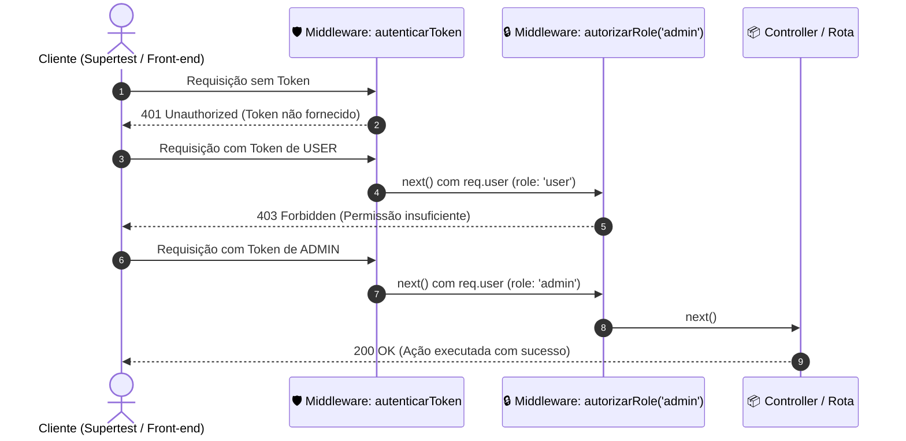

# 🛡️ Aula 06 — Testes de Middleware e Autenticação

> **Módulo:** Testes de Back-End — Programador Full-Stack (SENAI)  
> **Tecnologias:** Node.js, Express, Jest, Supertest, JWT (JSON Web Token)

---

## 🎯 Objetivos Pedagógicos da Aula

Nesta aula prática, exploramos como testar a **segurança de APIs REST**, focando em:
1. **Middlewares do Express**: Interceptação e validação de requisições (`req`, `res`, `next`).
2. **Autenticação via JWT (`401 Unauthorized`)**:
   - Bloqueio de requisições sem cabeçalho `Authorization`.
   - Rejeição de tokens inválidos, expirados ou assinados com chave incorreta.
3. **Autorização Baseada em Papel / RBAC (`403 Forbidden`)**:
   - Diferenciação de perfis (`user` vs `admin`).
   - Bloqueio de usuários autênticos tentando acessar recursos restritos a administradores.
4. **Sanitização de Dados Sensíveis**:
   - Garantir que hashes de senha e dados sigilosos nunca sejam vazados nas respostas da API.

---

## 🔄 Fluxo de Autenticação e Autorização



---

## 📂 Estrutura do Projeto

```text
Aula06/
├── src/
│   ├── config/
│   │   └── jwt.js                  # Chave secreta e gerador de tokens JWT
│   ├── middlewares/
│   │   ├── auth.middleware.js      # Validação do Bearer token (401)
│   │   └── role.middleware.js      # Controle de acesso por perfil RBAC (403)
│   ├── app.js                      # Configuração do Express e rotas da API
│   └── server.js                   # Inicialização do servidor HTTP
├── test/
│   └── auth-middleware.spec.js     # Suíte de testes com Supertest e Jest
├── package.json
└── README.md
```

---

## 🧪 Matriz dos Cenários de Teste

| # | Cenário | Rota | Autenticação | Status Esperado |
|---|---|---|---|:---:|
| **CT-01** | Requisição sem token de autenticação | `GET /usuarios` | Ausente | `401 Unauthorized` |
| **CT-02** | Cabeçalho malformatado (sem `Bearer`) | `GET /usuarios` | `TokenInvalido` | `401 Unauthorized` |
| **CT-03** | Token adulterado (chave secreta falsa) | `GET /usuarios` | Assinado com segredo errado | `401 Unauthorized` |
| **CT-04** | Token com tempo expirado (`expiresIn: 0s`) | `GET /usuarios` | Token expirado | `401 Unauthorized` |
| **CT-05** | Acesso com token de usuário comum | `GET /usuarios` | Token Válido (`user`) | `200 OK` |
| **CT-06** | Consulta de perfil decodificado via JWT | `GET /perfil` | Token Válido (`user`) | `200 OK` |
| **CT-07** | Usuário comum tentando deletar recurso de admin | `DELETE /produtos/1` | Token Válido (`user`) | `403 Forbidden` |
| **CT-08** | Administrador executando exclusão de produto | `DELETE /produtos/1` | Token Válido (`admin`) | `200 OK` |
| **CT-09** | Verificação de não vazamento de `senhaHash` | `GET /usuarios` | Token Válido (`admin`) | `200 OK` (sem `senhaHash`) |

---

## 🚀 Como Executar

### 1. Instalar as Dependências
Na pasta `Aula06`:
```bash
npm install
```

### 2. Executar os Testes Automatizados
```bash
npm test
```

### 3. Modo de Observação Contínua (Watch Mode)
```bash
npm run test:watch
```

### 4. Subir o Servidor Localmente (Opcional)
```bash
npm start
```
O servidor responderá na porta `3000`.
